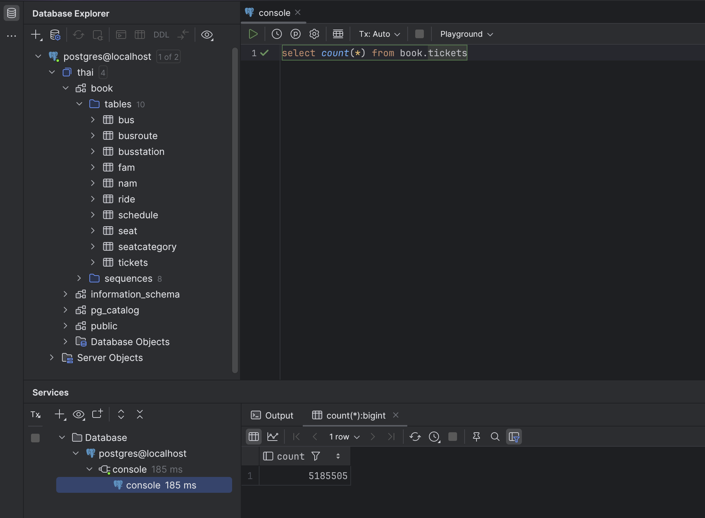

# Домашнее задание №1

1. Развернул базу данных с помощью docker.

   - [Ссылка на используемый docker-compose файла](../docker-compose.yml)

2. Далее я скачал самый легкий dump на 600мб. Прокинул через docker volume этот файл внутрь контейнера и с помощью команды `psql < thai.sql` залил данные.
3. Результат выполнения `select count(*) from book.tickets;`:
   
