# Домашнее задание №2

- Примечание:
  - Для удобства, я не подключаюсь к ВМ, а продолжаю работать с postgres в Docker контейнере
  - Также, по заданию надо пункты выполнять через psql. Я могу это cделать через консоль без проблем, но мне просто удобнее это делать через GUI

1. Через IDE подключаюсь к локальной базе и открываю две разные сессии из под пользователя postgres:
   
2. Сделано в первом пункте
3. Сделано в первом пункте
4. Я создаю таблицу `table_1`, создаю хранимую процедуру, которая заполняет данными данную таблицу, далее вызываю данную хранимку
   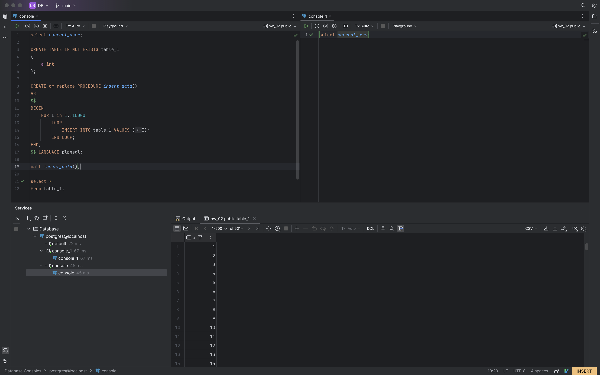
5. По умолчанию стоит уровень изоляции `read commited`
   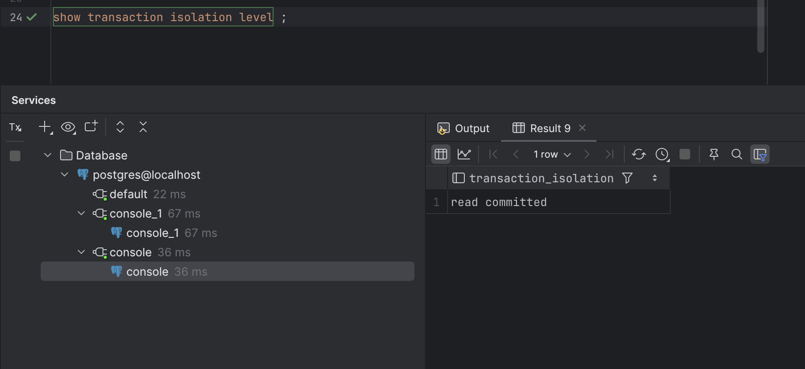
6. Просто начинаю две транзакции в обоих сессиях. Также в настройках сессии в DataGrip я выставил `Tx:Manual` вместо `Tx:Auto`, что бы я мог самостоятельно контролировать состояние транзакции
   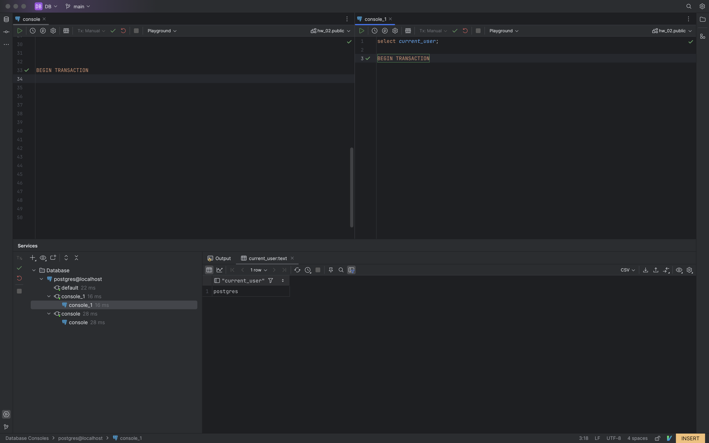
7. Добавляю строку в таблицу в первой сессии
   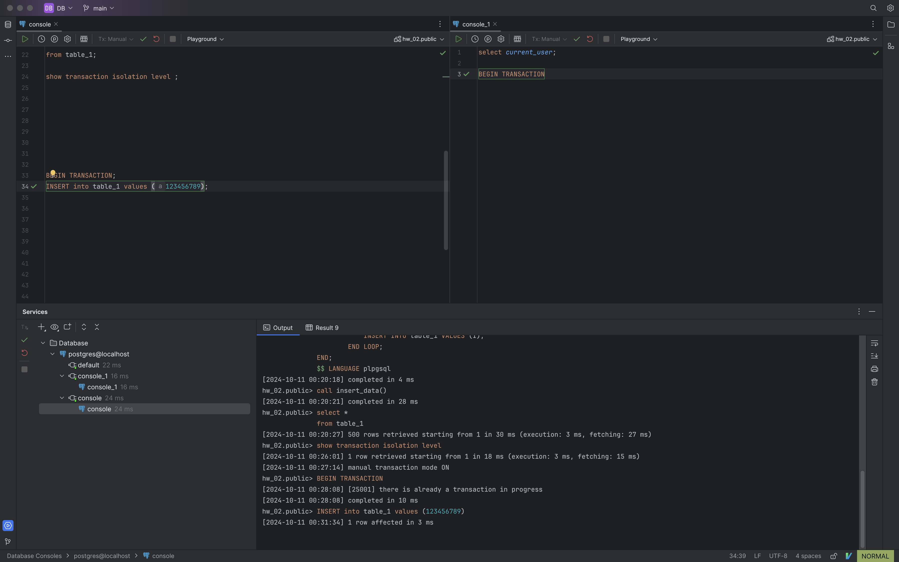
8. Делаю запрос к таблице, что бы найти новую запись
   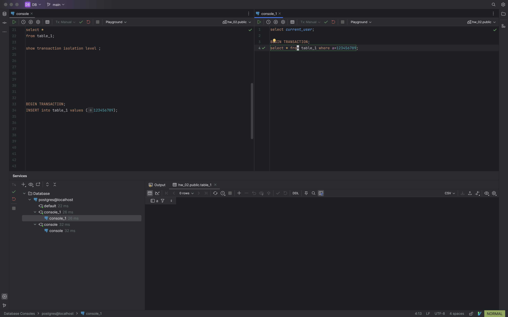
9. Нет, её нет. Потому что уровень изоляции выставлен `read commited`, а первая транзакция ещё не закомитилась. Мы могли бы её увидеть, если бы уровень исзоляции был `read uncomited`, и тогда мы бы увидели аномалию `dirty read`. Но в postgres нельзя выставить данный уровень изоляции.
10. 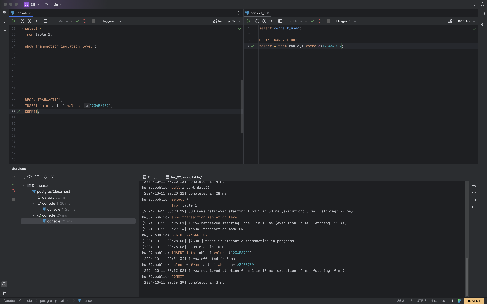
11. 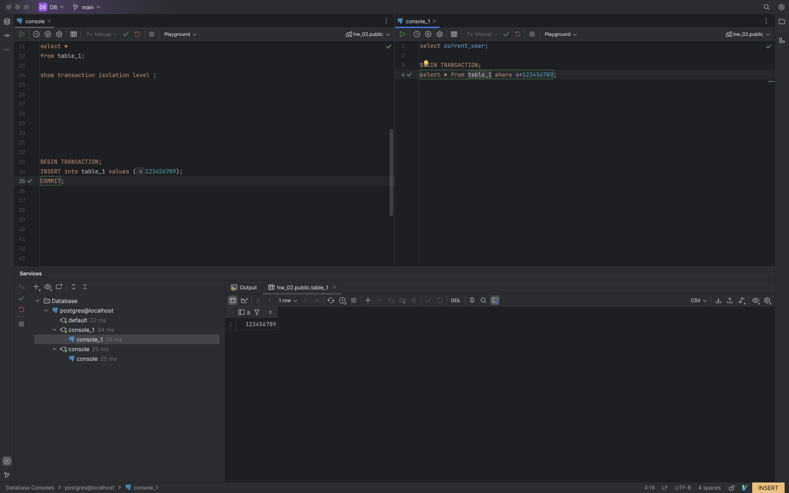
12. Да, потому что мы сделали комит в первой транзакции и теперь во второй сессии виден результат работы первой транзакции. Но это аномалия `unrepeatable read`: внутри одной транзакции результаты запросов к одной и той же таблице отличаются друг от друга.
13. 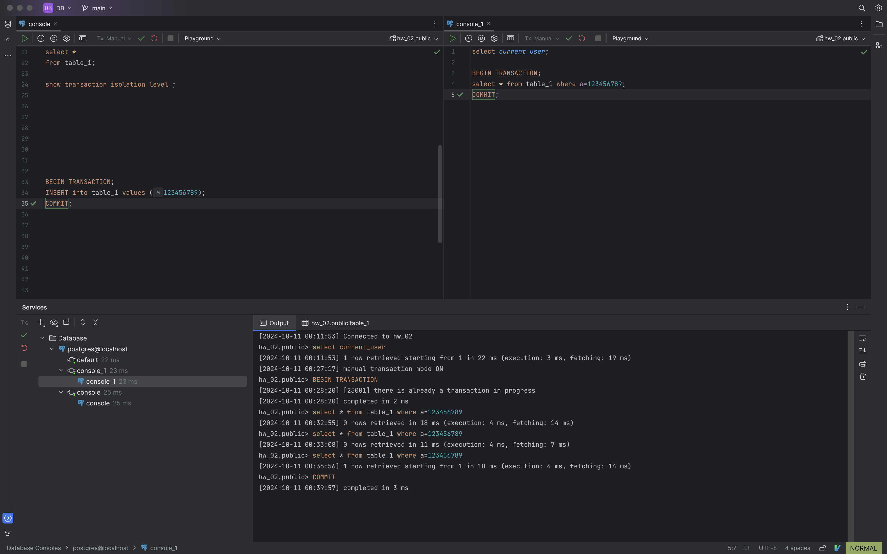
14. Устанавливаем уровень изоляции транзакции на `repeatable read` через GUI начинаю транзакцию:
    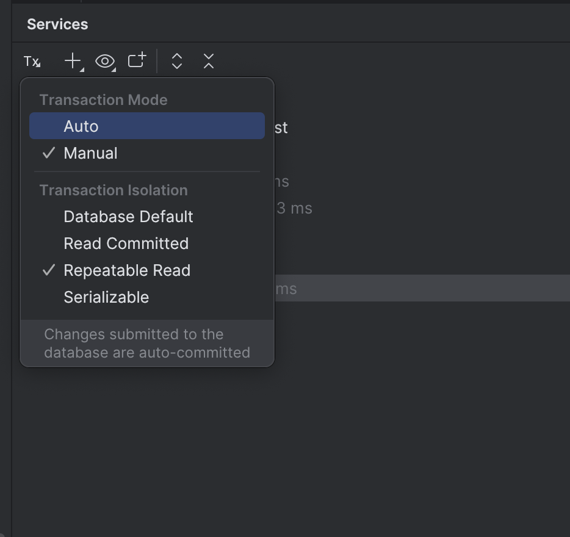
15. 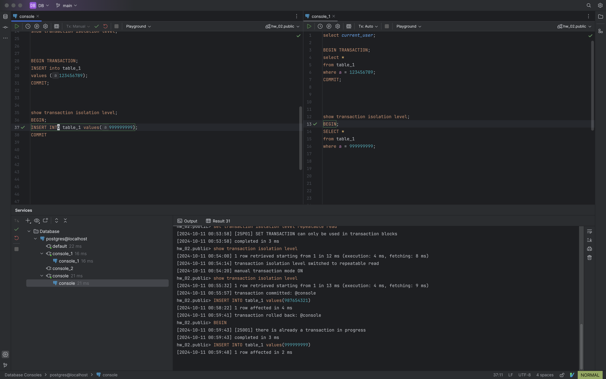
16. 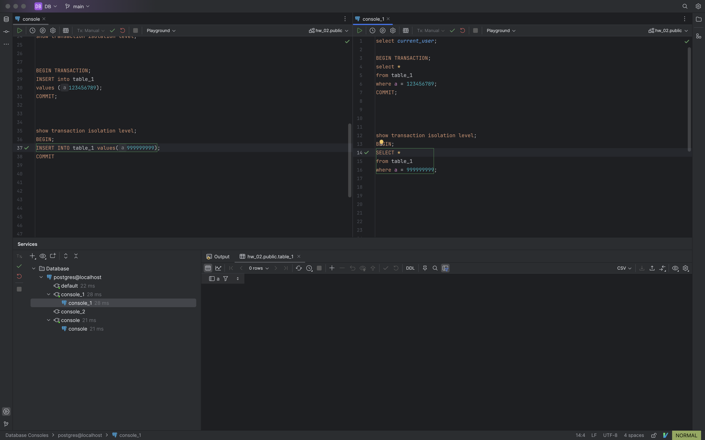
17. Нет, записи нет, по той же причине, по которой не было записи уровнем ниже. Аномалии `dirty read` нет на уровне `repeatable read`
18. 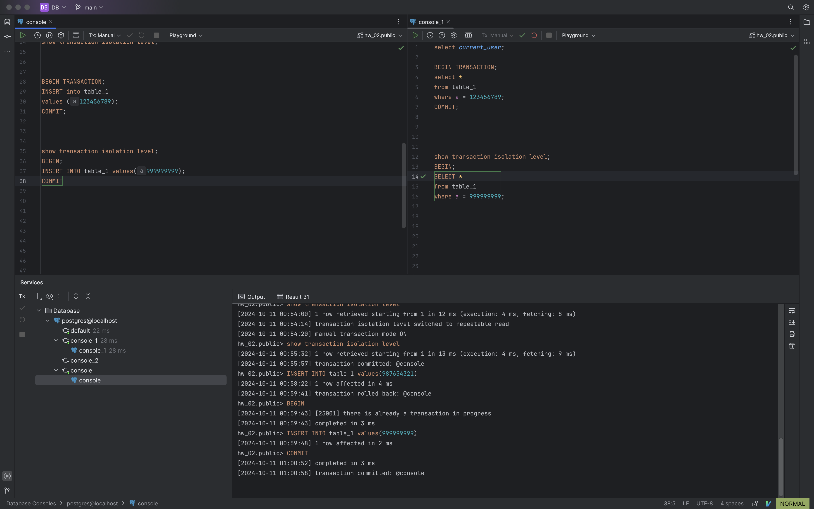
19. 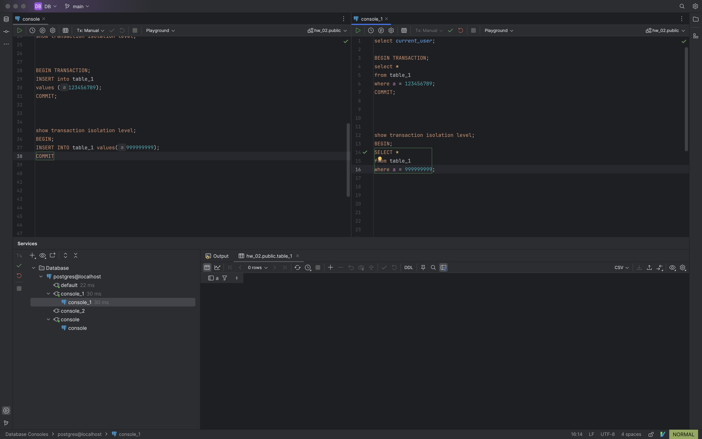
20. Нет, записи нет, потому что на уровне `repeatable read` нет аномалии `unrepeatable read`.
